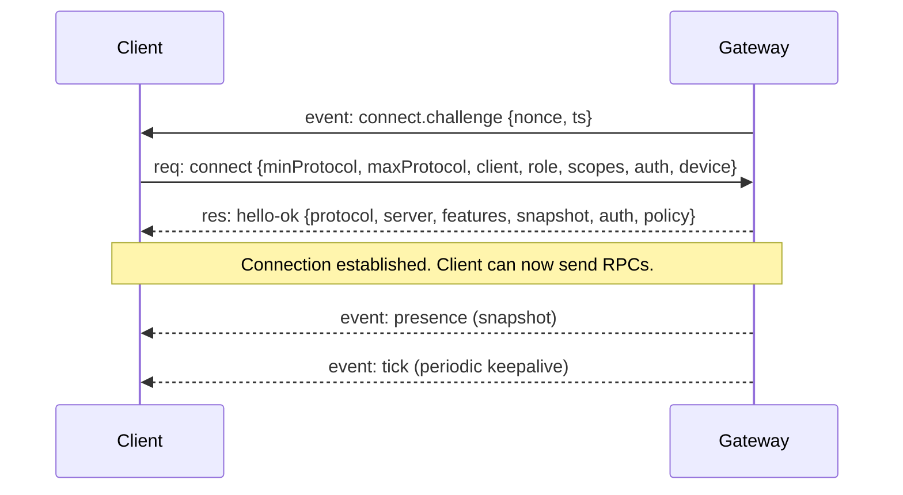
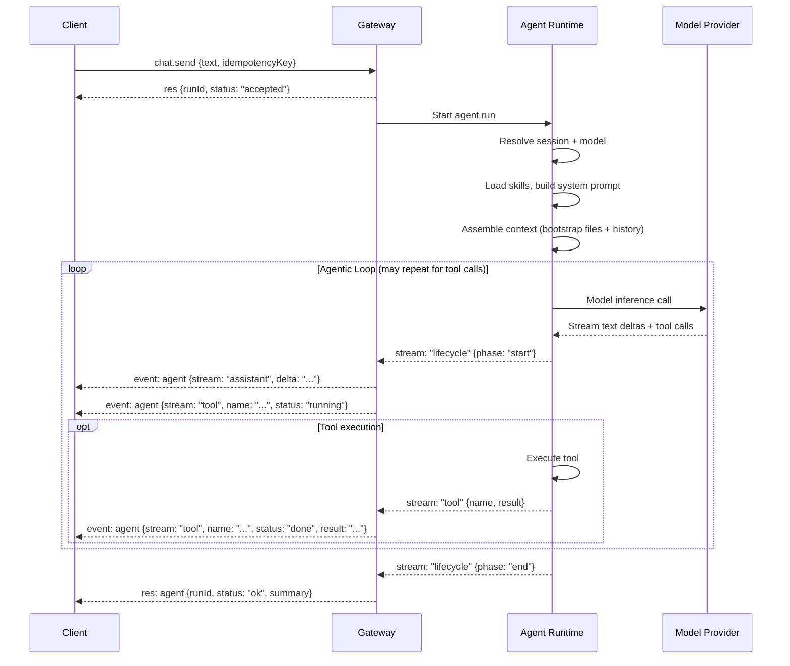

# OpenClaw Chat Interface — Deep Dive

A detailed reference for understanding how OpenClaw's chat interface works: the WebSocket protocol, message flow, content types, streaming, and what to consider if you're building a custom chat control.

---

## Table of Contents

- [Overview](#overview)
- [Transport Layer](#transport-layer)
- [WebSocket Protocol](#websocket-protocol)
  - [Frame Types](#frame-types)
  - [Handshake Flow](#handshake-flow)
  - [Authentication](#authentication)
  - [Device Pairing](#device-pairing)
- [Chat RPCs — The Core API](#chat-rpcs--the-core-api)
  - [chat.history](#chathistory)
  - [chat.send](#chatsend)
  - [chat.abort](#chatabort)
  - [chat.inject](#chatinject)
- [Agent Run Lifecycle](#agent-run-lifecycle)
- [What Content Flows Over the Wire](#what-content-flows-over-the-wire)
  - [Inbound (User → Gateway)](#inbound-user--gateway)
  - [Outbound (Gateway → Client)](#outbound-gateway--client)
  - [Agent Stream Events](#agent-stream-events)
  - [Tool Calls and Results](#tool-calls-and-results)
- [Streaming and Chunking](#streaming-and-chunking)
  - [Block Streaming](#block-streaming)
  - [Preview Streaming](#preview-streaming)
  - [Chunking Algorithm](#chunking-algorithm)
  - [Coalescing](#coalescing)
- [Session RPCs (Advanced)](#session-rpcs-advanced)
- [Existing Chat Implementations](#existing-chat-implementations)
- [Building a Custom Chat Control](#building-a-custom-chat-control)
  - [Connection Lifecycle Checklist](#connection-lifecycle-checklist)
  - [Rendering Concerns](#rendering-concerns)
  - [Streaming UX](#streaming-ux)
  - [Content You Must Handle](#content-you-must-handle)
  - [Edge Cases and Gotchas](#edge-cases-and-gotchas)
  - [Security Considerations](#security-considerations)
- [Protocol Constants Reference](#protocol-constants-reference)
- [Event Families Reference](#event-families-reference)
- [Further Reading](#further-reading)

---

## Overview

OpenClaw's chat is not a REST API — it's a **persistent WebSocket connection** between your client and the Gateway daemon. The Gateway is the single source of truth for all sessions, transcripts, and agent runs.

```
┌──────────────┐         WebSocket (JSON text frames)         ┌──────────────┐
│  Your Chat   │ ◄──────────────────────────────────────────► │   Gateway    │
│  Control     │    req/res + server-pushed events            │   Daemon     │
│              │                                              │  :18789      │
└──────────────┘                                              └──────────────┘
```

Key points:
- **Transport:** WebSocket, text frames, JSON payloads
- **Port:** default `127.0.0.1:18789`
- **Protocol version:** 3 (current)
- **Auth:** shared-secret token or password, device pairing, or Tailscale identity
- **Session state:** owned entirely by the Gateway, not the client

---

## Transport Layer

| Property | Value |
|----------|-------|
| Protocol | WebSocket (RFC 6455) |
| Frame type | Text frames with JSON payloads |
| Default bind | `127.0.0.1:18789` |
| Max payload | 25 MB (`MAX_PAYLOAD_BYTES`) |
| Pre-connect frame cap | 64 KiB |
| Keepalive | `tick` events at `policy.tickIntervalMs` (default 15s) |
| Tick timeout | Client closes with code `4000` if silence exceeds `tickIntervalMs * 2` |
| TLS | Optional, with optional cert fingerprint pinning |

---

## WebSocket Protocol

### Frame Types

Every WebSocket message is one of three JSON frame types:

```
┌─────────────────────────────────────────────────────────────────┐
│  Request (client → server)                                      │
│  { "type": "req", "id": "…", "method": "…", "params": {…} }   │
├─────────────────────────────────────────────────────────────────┤
│  Response (server → client)                                     │
│  { "type": "res", "id": "…", "ok": true|false,                │
│    "payload": {…} | "error": {…} }                             │
├─────────────────────────────────────────────────────────────────┤
│  Event (server → client, push)                                  │
│  { "type": "event", "event": "…", "payload": {…},             │
│    "seq": N, "stateVersion": N }                               │
└─────────────────────────────────────────────────────────────────┘
```

- **Requests** are client-initiated RPCs. Side-effecting methods require **idempotency keys**.
- **Responses** match requests by `id`.
- **Events** are server-pushed and have per-client monotonic `seq` numbers.

### Handshake Flow

The first frame **must** be a `connect` request. Any non-JSON or non-connect first frame is a hard close.



The `hello-ok` response includes:

| Field | Purpose |
|-------|---------|
| `protocol` | Negotiated protocol version |
| `server.version` | Gateway version |
| `server.connId` | Connection identifier |
| `features.methods` | Available RPC methods |
| `features.events` | Available event types |
| `snapshot` | Initial state (presence, health) |
| `auth.role` | Negotiated role (`operator` or `node`) |
| `auth.scopes` | Granted scopes |
| `auth.deviceToken` | Issued device token (persist this!) |
| `policy.maxPayload` | Max frame size in bytes |
| `policy.maxBufferedBytes` | Max outbound buffer |
| `policy.tickIntervalMs` | Keepalive interval |

### Authentication

Authentication happens during the `connect` handshake:

| Method | Config | How |
|--------|--------|-----|
| **Shared token** | `gateway.auth.mode: "token"` | `connect.params.auth.token` |
| **Password** | `gateway.auth.mode: "password"` | `connect.params.auth.password` |
| **Tailscale** | `gateway.auth.allowTailscale: true` | Identity from HTTP headers |
| **Trusted proxy** | `gateway.auth.mode: "trusted-proxy"` | Identity from proxy headers |
| **None** | `gateway.auth.mode: "none"` | No auth (private ingress only!) |

After pairing, the Gateway issues a **device token** scoped to your role + scopes. Persist it and reuse on reconnect.

### Device Pairing

New devices require one-time pairing approval:

1. Client connects → Gateway returns `pairing required` (close code 1008)
2. Approve via CLI: `openclaw devices approve <requestId>`
3. Reconnect → device token issued

**Exception:** Direct loopback connections (`127.0.0.1`) are auto-approved.

---

## Chat RPCs — The Core API

These are the four methods that make up the chat interface:

### chat.history

Fetches the conversation transcript for the current session.

```json
// Request
{ "type": "req", "id": "1", "method": "chat.history", "params": {} }

// Response
{
  "type": "res", "id": "1", "ok": true,
  "payload": {
    "sessionId": "abc-123",
    "messages": [
      { "role": "user", "content": "Hello!", "ts": 1714600000000 },
      { "role": "assistant", "content": "Hi there!", "ts": 1714600001000 }
    ]
  }
}
```

**Important display-normalization applied by the Gateway:**
- Inline delivery directive tags (`[[reply_to_*]]`, `[[audio_as_voice]]`) are stripped
- Plain-text tool-call XML payloads are stripped (`<tool_call>`, `<function_call>`, etc.)
- Leaked model control tokens are stripped
- Silent-token assistant entries (`NO_REPLY` / `no_reply`) are omitted
- Oversized entries may be replaced with `[chat.history omitted: message too large]`
- Reasoning-flagged payloads (`isReasoning: true`) are excluded from visible content
- Long text fields can be truncated (`gateway.webchat.chatHistoryMaxChars`)
- History follows the active transcript branch (abandoned rewrites are hidden)

### chat.send

Sends a user message and triggers an agent run.

```json
// Request
{
  "type": "req", "id": "2",
  "method": "chat.send",
  "params": {
    "text": "What's the weather?",
    "sessionId": "abc-123",
    "idempotencyKey": "unique-key-123"
  }
}

// Immediate acknowledgment
{
  "type": "res", "id": "2", "ok": true,
  "payload": { "runId": "run-456", "status": "accepted" }
}

// Then: streaming agent events arrive as events...
// Finally: terminal response
{
  "type": "res", "id": "2", "ok": true,
  "payload": { "runId": "run-456", "status": "ok", "summary": "..." }
}
```

**Idempotency keys are required** — the Gateway dedupes repeated requests with the same key.

### chat.abort

Aborts an active agent run.

```json
{ "type": "req", "id": "3", "method": "chat.abort", "params": { "runId": "run-456" } }
```

- Partial assistant output may still be visible after abort.
- Gateway persists aborted partial text into transcript with abort metadata.

### chat.inject

Appends an assistant note directly to the transcript **without** triggering an agent run.

```json
{
  "type": "req", "id": "4",
  "method": "chat.inject",
  "params": { "text": "System maintenance in 5 minutes." }
}
```

Broadcasts the injection to all connected UI clients.

---

## Agent Run Lifecycle

When `chat.send` triggers a run, the agent goes through this lifecycle:



Key streams emitted during a run:

| Stream | Content |
|--------|---------|
| `lifecycle` | `phase: "start"`, `"end"`, or `"error"` |
| `assistant` | Text deltas as the model generates output |
| `tool` | Tool call events (name, args, status, result) |

---

## What Content Flows Over the Wire

### Inbound (User → Gateway)

| Content Type | How it arrives |
|-------------|---------------|
| Plain text | `chat.send` with `text` |
| Slash commands | Text starting with `/` (e.g., `/new`, `/model`, `/status`, `/reasoning on`) |
| Media/attachments | Channel-dependent; media flushes immediately (no debounce) |
| Steering messages | Injected into active runs when queue mode is `steer` |

**Inbound debouncing:** Rapid consecutive text messages from the same sender can be batched into one agent turn (`messages.inbound.debounceMs`, default 2000ms). Media bypasses debounce.

**Inbound deduplication:** Short-lived cache prevents duplicate deliveries after reconnects.

### Outbound (Gateway → Client)

| Content Type | Description |
|-------------|-------------|
| Assistant text | Markdown-formatted replies (may be chunked) |
| Tool call cards | Structured tool call metadata for UI rendering |
| Media | Images, audio, files via `MEDIA:` directives or tool `details` |
| Silent replies | `NO_REPLY` — suppressed in UI, used internally |
| Reasoning content | Model thinking (hidden by default, toggle with `/reasoning on`) |
| Block-streamed chunks | Partial replies sent as the model generates |

### Agent Stream Events

During an active run, the Gateway pushes `event: agent` frames:

```json
// Assistant text delta
{
  "type": "event",
  "event": "agent",
  "payload": {
    "stream": "assistant",
    "runId": "run-456",
    "delta": "The weather in Seattle is..."
  }
}

// Tool call started
{
  "type": "event",
  "event": "agent",
  "payload": {
    "stream": "tool",
    "runId": "run-456",
    "name": "web_search",
    "status": "running",
    "args": { "query": "Seattle weather" }
  }
}

// Tool call completed
{
  "type": "event",
  "event": "agent",
  "payload": {
    "stream": "tool",
    "runId": "run-456",
    "name": "web_search",
    "status": "done",
    "result": { "content": "..." }
  }
}

// Lifecycle end
{
  "type": "event",
  "event": "agent",
  "payload": {
    "stream": "lifecycle",
    "runId": "run-456",
    "phase": "end"
  }
}
```

### Tool Calls and Results

Tool results have two parts:
- **`content`** — model-visible result text
- **`details`** — runtime metadata for UI rendering, diagnostics, media delivery (stripped before model replay)

Your chat control should render tool calls as expandable cards showing:
- Tool name and arguments
- Running/done/error status
- Result summary (from `content`)
- Any media or artifacts (from `details`)

---

## Streaming and Chunking

OpenClaw has **two separate streaming layers:**

### Block Streaming

Sends completed **blocks** of assistant output as normal channel messages (not token deltas).

```
Model output
  └─ text_delta events
       └─ EmbeddedBlockChunker (min/max bounds + break preference)
            └─ Channel send (block replies)
```

- **Off by default** (`agents.defaults.blockStreamingDefault: "off"`)
- Break modes: `text_end` (stream as blocks complete) or `message_end` (buffer until done)
- Non-Telegram channels require explicit `*.blockStreaming: true`

### Preview Streaming

Updates a temporary **preview message** while generating (Telegram/Discord/Slack only). This is message-based (send + edits/appends), **not** true token-delta streaming.

### Chunking Algorithm

The `EmbeddedBlockChunker` applies:

1. **Low bound:** don't emit until buffer ≥ `minChars` (unless forced)
2. **High bound:** prefer splits before `maxChars`; hard-split at `maxChars` if forced
3. **Break preference:** paragraph → newline → sentence → whitespace → hard break
4. **Code fences:** never split inside fences; if forced, close + reopen to keep Markdown valid
5. **Channel cap:** `maxChars` clamped to channel `textChunkLimit`

### Coalescing

Idle-based merge of streamed blocks before send (`blockStreamingCoalesce`). Reduces single-line spam by batching rapid small chunks.

---

## Session RPCs (Advanced)

Beyond the core `chat.*` methods, there are powerful session management RPCs:

| Method | Purpose |
|--------|---------|
| `sessions.list` | List all sessions with metadata |
| `sessions.subscribe` | Subscribe to session change events |
| `sessions.messages.subscribe` | Subscribe to transcript events for one session |
| `sessions.preview` | Get bounded transcript previews |
| `sessions.describe` | Get one session's details |
| `sessions.create` | Create a new session |
| `sessions.send` | Send a message into a specific session |
| `sessions.steer` | Interrupt-and-steer an active session |
| `sessions.abort` | Abort active work (by key or runId) |
| `sessions.patch` | Update session metadata/overrides (model, thinking, etc.) |
| `sessions.reset` | Reset a session |
| `sessions.delete` | Delete a session |
| `sessions.compact` | Trigger compaction (summarize long conversations) |

---

## Existing Chat Implementations

OpenClaw ships with several chat interfaces you can reference:

| Implementation | Stack | Description |
|---------------|-------|-------------|
| **Control UI** | Vite + Lit (Web Components) | Browser SPA served by Gateway at `http://<host>:18789/` |
| **WebChat** | Native SwiftUI (macOS/iOS) | Direct Gateway WS connection, no embedded browser |
| **TUI** | Terminal UI | CLI-based chat interface |

The Control UI is the most accessible reference — it speaks directly to the Gateway WebSocket on the same port and handles all the content types described above.

---

## Building a Custom Chat Control

### Connection Lifecycle Checklist

```
1. Open WebSocket to ws://127.0.0.1:18789
2. Wait for connect.challenge event {nonce, ts}
3. Sign the challenge nonce with your device keypair
4. Send connect request with:
   - minProtocol: 3, maxProtocol: 3
   - client info (id, version, platform, mode: "operator")
   - role: "operator", scopes: ["operator.read", "operator.write"]
   - auth (token or password)
   - device identity (id, publicKey, signature, signedAt, nonce)
5. Receive hello-ok → persist deviceToken
6. Honor policy.tickIntervalMs for keepalive detection
7. Handle reconnect with exponential backoff (1s initial, 30s max)
8. On reconnect, reuse stored deviceToken
```

### Rendering Concerns

Your chat control needs to handle these content types:

| Content | Rendering |
|---------|-----------|
| **Markdown text** | Full Markdown rendering (headings, lists, bold, italic, links, images) |
| **Code blocks** | Syntax-highlighted fenced code with language tags |
| **Mermaid diagrams** | Render `mermaid` fenced blocks as diagrams |
| **Tool call cards** | Expandable cards showing tool name, args, status, result |
| **Media attachments** | Images, audio players, file download links |
| **Reasoning content** | Collapsible "thinking" blocks (hidden by default) |
| **Silent replies** | `NO_REPLY` — filter these out, don't render |
| **Streamed deltas** | Append text incrementally for live typing effect |
| **Aborted responses** | Show partial text with visual indicator |
| **Block-streamed chunks** | Multiple messages that are logically one response |
| **LaTeX / math** | Some models output math notation |

### Streaming UX

```
┌─────────────────────────────────────────┐
│  User: What's the weather?              │
├─────────────────────────────────────────┤
│  🔄 Thinking...                         │  ← lifecycle start
│  🔧 web_search("Seattle weather")       │  ← tool stream (running)
│  ✅ web_search completed                │  ← tool stream (done)
│  🤖 The weather in Seattle is currently │  ← assistant delta (streaming)
│     62°F with partly cloudy skies...    │  ← assistant delta (appending)
└─────────────────────────────────────────┘
```

- Subscribe to `agent` events filtered by `runId`
- Accumulate `assistant` deltas into a growing text buffer
- Show tool calls as inline cards between text blocks
- Handle `lifecycle.end` to finalize the message
- Handle `lifecycle.error` to show error state

### Content You Must Handle

**Inbound (sending):**
- [ ] Plain text messages
- [ ] Slash commands (`/new`, `/model gpt-4`, `/status`, `/reasoning on|off`)
- [ ] Idempotency keys on every `chat.send`
- [ ] Track `sessionId` from `chat.history` and include it on subsequent sends
- [ ] Debounce rapid sends client-side (Gateway also debounces at 2s default)

**Outbound (receiving):**
- [ ] `chat.history` — initial transcript load + display normalization
- [ ] `agent` events — streaming deltas (assistant text, tool calls, lifecycle)
- [ ] `chat` events — injected messages, transcript updates
- [ ] `session.message` / `session.tool` — if using `sessions.messages.subscribe`
- [ ] `sessions.changed` — session list/metadata changes
- [ ] `tick` — keepalive (close if 2× interval exceeded with no events)
- [ ] `presence` — connected device list changes
- [ ] `shutdown` — Gateway shutting down

### Edge Cases and Gotchas

| Issue | What happens | How to handle |
|-------|-------------|---------------|
| **Duplicate sends** | Gateway dedupes by idempotency key | Always send unique keys |
| **Reconnect during run** | You miss streamed events | Re-fetch `chat.history` on reconnect |
| **Aborted runs** | Partial assistant text persisted | Show with abort indicator |
| **Silent replies** | `NO_REPLY` in transcript | Filter from display |
| **Oversized history** | Entries replaced with placeholders | Handle gracefully |
| **Concurrent sends** | Queued per session | Show "processing" state |
| **Session reset** | `/new` or daily reset at 4 AM | Clear transcript, re-fetch history |
| **Stale device token** | `AUTH_TOKEN_MISMATCH` close | Retry once with stored token, then surface error |
| **Model control token leak** | Raw tokens in text | Gateway strips these, but add client-side fallback |
| **Code fence splitting** | Chunker may close/reopen fences | Render each chunk independently |
| **Media deduplication** | Same media URL sent in stream + final | Gateway handles this, but guard against duplicates |
| **Multiple connected clients** | All see same session | History not fully synced back to every client |
| **Pairing required** | Close code 1008 | Show pairing instructions |

### Security Considerations

- **Always use auth** — never expose `gateway.auth.mode: "none"` on public networks
- **Persist device tokens securely** — they grant scoped access
- **Validate `connect.challenge` nonce** — sign with your device keypair
- **Scope-gated broadcasts** — chat/agent events require `operator.read`
- **Content exclusion** — some files may be restricted by org policy
- **DM isolation** — if multi-user, set `session.dmScope: "per-channel-peer"` so users don't share sessions

---

## Protocol Constants Reference

| Constant | Value | Source |
|----------|-------|--------|
| `PROTOCOL_VERSION` | `3` | `protocol-schemas.ts` |
| Request timeout | `30,000` ms | `client.ts` |
| Pre-auth timeout | `15,000` ms | `handshake-timeouts.ts` |
| Initial reconnect backoff | `1,000` ms | `client.ts` |
| Max reconnect backoff | `30,000` ms | `client.ts` |
| Fast-retry after token close | `250` ms | `client.ts` |
| Default tick interval | `15,000` ms (server-configurable) | `client.ts` |
| Tick timeout close code | `4000` | at `tickIntervalMs * 2` silence |
| Max payload | `25 MB` (25 × 1024 × 1024) | `server-constants.ts` |
| Default inbound debounce | `2,000` ms | `messages.inbound.debounceMs` |

---

## Event Families Reference

| Event | Scope required | Description |
|-------|---------------|-------------|
| `agent` | `operator.read` | Agent run stream (assistant/tool/lifecycle) |
| `chat` | `operator.read` | Transcript updates, injections |
| `session.message` | `operator.read` | Per-session transcript events (subscribed) |
| `session.tool` | `operator.read` | Per-session tool events (subscribed) |
| `sessions.changed` | `operator.read` | Session index/metadata changes |
| `presence` | None | Connected device list |
| `tick` | None | Keepalive |
| `health` | None | Gateway health snapshot |
| `heartbeat` | None | Heartbeat event |
| `shutdown` | None | Gateway shutting down |
| `node.pair.*` | None | Node pairing lifecycle |
| `device.pair.*` | None | Device pairing lifecycle |
| `exec.approval.*` | `operator.approvals` | Exec approval lifecycle |
| `voicewake.changed` | None | Wake-word config changed |

---

## Further Reading

- [Gateway Protocol (full spec)](https://docs.openclaw.ai/gateway/protocol)
- [Messages (flow + queueing)](https://docs.openclaw.ai/concepts/messages)
- [Streaming + Chunking](https://docs.openclaw.ai/concepts/streaming)
- [Agent Loop](https://docs.openclaw.ai/concepts/agent-loop)
- [Control UI](https://docs.openclaw.ai/web/control-ui)
- [WebChat](https://docs.openclaw.ai/web/webchat)
- [Session Management](https://docs.openclaw.ai/concepts/session)
- [Queue + Steering](https://docs.openclaw.ai/concepts/queue-steering)
- [Gateway Authentication](https://docs.openclaw.ai/gateway/authentication)
- [Gateway Configuration](https://docs.openclaw.ai/gateway/configuration)
